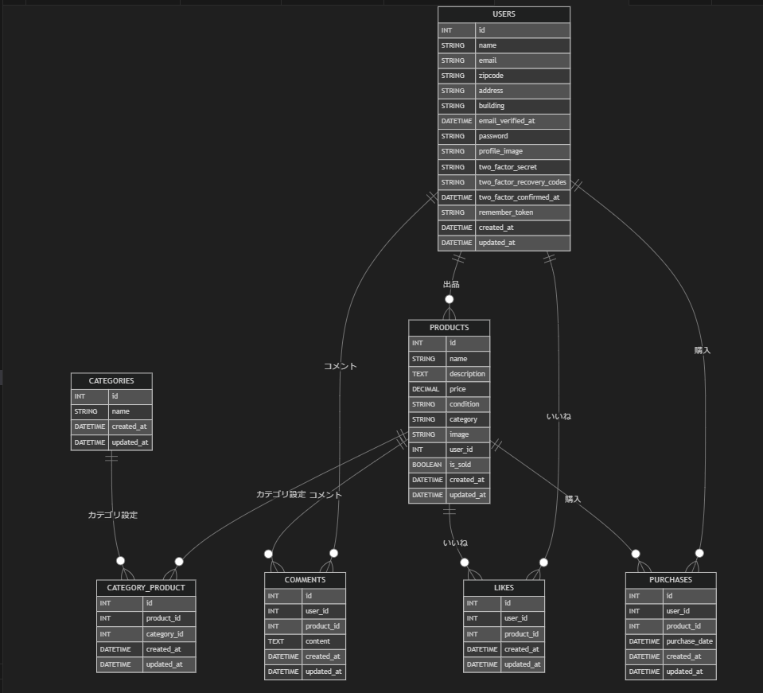

# フリマアプリ

## 概要
このプロジェクトは、アイテムの出品と購入を行うための**フリマアプリ**です。  
Laravel を使用して開発されており、ユーザーは商品を出品したり、他のユーザーの商品を購入することができます。

---

## 主な機能
- **ユーザー認証**
  - ログイン / 会員登録 / メール認証
- **商品管理**
  - 商品の出品 / 編集
  - 商品の一覧表示
  - 商品の詳細表示
- **購入機能**
  - 商品の購入
  - 支払い方法の選択（クレジットカード・コンビニ払い）
  - 配送先の設定・変更
- **いいね機能**
  - 商品への「いいね」登録 / 解除
- **コメント機能**
  - 商品へのコメント投稿 / 表示
- **マイページ**
  - プロフィール編集
  - 出品商品一覧
  - 購入履歴表示

---

## 使用技術
- **フレームワーク**: Laravel 10
- **フロントエンド**: Blade, CSS
- **データベース**: MySQL
- **認証**: Laravel Fortify
- **メール送信**: MailHog (開発環境)
---

## インストール方法
### 1️⃣ **リポジトリをクローン**
```bash
git clone https://github.com/your-repo/flea-market-app.git
cd freemarket-app

### 2️⃣ **環境変数を設定**
```bash
cp .env.example .env
- .env を編集して、データベース接続情報を設定してください。

### 3️⃣ Dockerビルド**
```bash
docker-compose up -d
composer install

### 4️⃣ アプリキーを生成**
```bash
php artisan key:generate

### 5️⃣ データベースをセットアップ**
```bash
php artisan migrate --seed

### 6️⃣ ストレージリンクを作成**
```bash
php artisan storage:link
- これにより、アップロードされた画像が storage/app/public に保存され、 public/storage から参照できるようになります。

## メール機能の確認（MailHog）
```bash
docker-compose up -d mailhog
-MailHog を起動後、ブラウザで http://localhost:8025/ にアクセスしてください。

---

## 使用技術(実行環境)
- PHP8.3.0
- Laravel8.83.27
- MySQL8.0.26
- Fortify
- Mailhog

## ER図


## URL
- 開発環境：http://localhost/
- phpMyAdmin：http://localhost:8080/
-mailhog:http://localhost:8025/